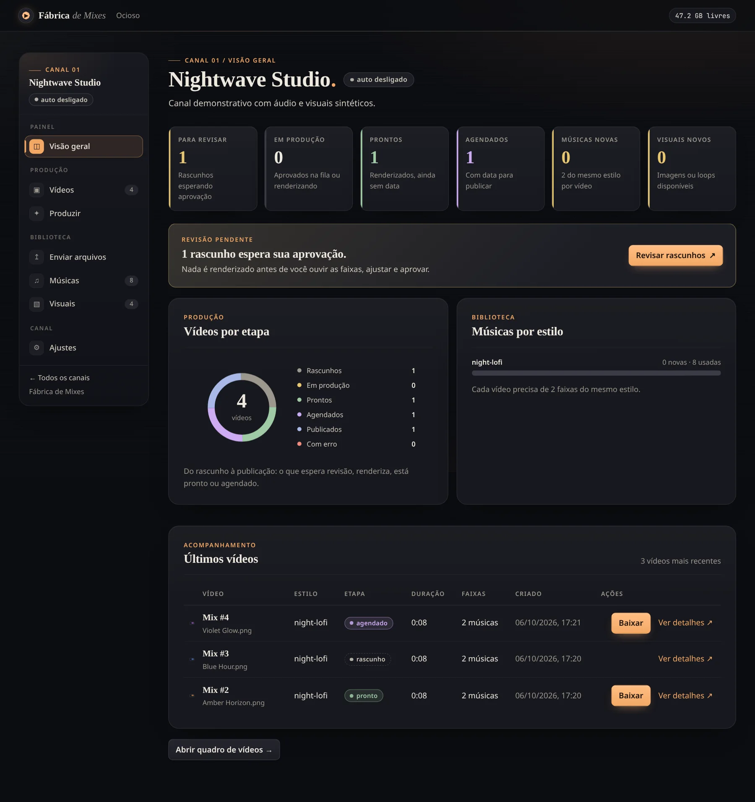
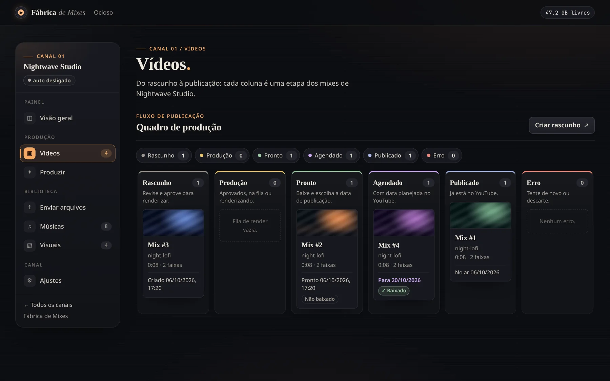
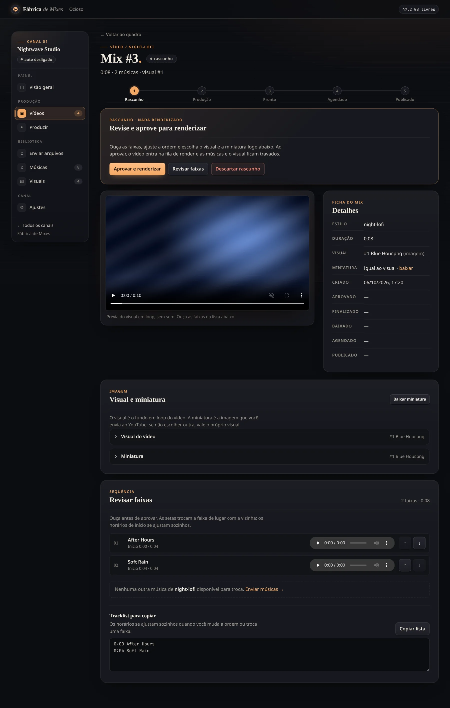

# Fábrica de Mixes

[English](README.md) | **Português (Brasil)**

[](https://matheuscara.github.io/fabrica-mixes/)
[](https://github.com/Matheuscara/fabrica-mixes/releases/tag/v0.1.0)
[](LICENSE)

**[Site do projeto](https://matheuscara.github.io/fabrica-mixes/)** ·
**[Versão v0.1.0](https://github.com/Matheuscara/fabrica-mixes/releases/tag/v0.1.0)** ·
**[Instalação](#início-rápido-docker)** · **[Licença MIT](LICENSE)**

Sistema auto-hospedado que monta mixes longos de música para o YouTube — sem precisar de GPU.
Você envia músicas e imagens/loops para cada canal; o sistema reserva **N músicas do mesmo estilo
+ 1 visual** num rascunho. Você revisa músicas, ordem, visual e miniatura, aprova, e o vídeo
renderizado fica disponível para baixar. A publicação no YouTube continua manual.

> **Sem login.** O site não tem autenticação: quem alcança a porta pode enviar, alterar e excluir
> arquivos. O Compose publica a porta somente em `127.0.0.1` por padrão. Leia
> [Acesso pela rede](#acesso-pela-rede-com-segurança) e [SECURITY.pt-BR.md](SECURITY.pt-BR.md) antes de abrir
> para outros dispositivos.

## Imagens

Capturadas de uma instância de demonstração isolada, com canais, músicas e visuais fictícios — não são
dados de produção.



*Visão geral do canal: vídeos por etapa e músicas novas x usadas por estilo.*



*Quadro de vídeos: Rascunho → Produção → Pronto → Agendado → Publicado.*



*Revisão do rascunho: reordene ou troque músicas, troque o visual e escolha a miniatura antes de
aprovar o render.*

## Recursos

- **Canais**: cada canal do YouTube tem as próprias músicas, visuais, estilos e vídeos.
- **Navegação por canal**: páginas de visão geral, vídeos, produção, envio, músicas, visuais e ajustes
  na barra lateral. No celular, abra pelo botão "Menu do canal".
- **Quadro de vídeos (kanban)**: Rascunho → Produção → Pronto → Agendado → Publicado (e Erro).
- **Visão geral**: gráficos de vídeos por etapa e de músicas novas/usadas por estilo. As animações
  respeitam a preferência de movimento reduzido e os gráficos se reorganizam no celular.
- **Estilos**: toda música tem um estilo (ex.: `lofi-jazz-lounge`) e um vídeo nunca mistura estilos.
  Ao arrastar uma pasta no site, o estilo é o nome da pasta onde a música está.
- **Prompt por estilo**: na página Músicas você cria o estilo e guarda o prompt usado para gerar as
  faixas, para editar e copiar depois. O site só guarda a receita; ele **não gera música**. Estilos
  criados pelo envio de uma pasta aparecem sem prompt até você preencher.
- **Ouça antes de usar**: cada faixa tem um player na página Músicas. Tocar outra pausa a anterior,
  e atualizações em segundo plano não interrompem a reprodução.
- **Sem duplicação**:
  - arquivo com o mesmo conteúdo (hash SHA-256) no mesmo canal é ignorado no envio;
  - música ou visual que já está em algum vídeo não é sorteado de novo — a não ser que você ligue
    "reaproveitar" nos ajustes do canal; aí as menos usadas vão primeiro;
  - descartar um vídeo libera as músicas e o visual dele; vídeo publicado continua contando como usado.
- **Revisão do rascunho**: reordenar e trocar músicas, trocar o visual e escolher a miniatura antes
  de aprovar. **Nada é renderizado sem sua aprovação.**
- **Render sem GPU**: cada imagem/vídeo enviado é convertido **uma vez** num loop H.264 1080p30
  (com barras pretas se não for 16:9). Depois, cada render só copia esse loop e codifica o áudio
  em AAC: cerca de 1–2 min por hora de mix numa CPU comum.
- **Transições suaves sem alterar os MP3s**: as músicas enviadas mantêm os bytes e a duração integral.
  Só ao renderizar o vídeo uma cauda quase inaudível é encurtada, antes de sobrepor faixas vizinhas
  num crossfade de até 2 segundos. A tracklist do rascunho segue o áudio mixado; vídeos já
  renderizados não mudam.
- **Modo automático** (por canal): mantém até X rascunhos ou vídeos não publicados, reservando material
  novo, mas nunca renderiza sem aprovação. Se houver vídeo com erro, ele pausa até você resolver.
- **Tracklist**: cada vídeo mostra o visual usado e as músicas com o tempo de início, pronta para
  copiar na descrição do YouTube.
- **Pós-publicação**: registre download, data planejada, link e data de publicação; depois de publicar,
  "Apagar arquivo" libera o espaço do vídeo e mantém o registro.

## Fluxo de trabalho

1. **Crie um canal** na página inicial.
2. **Envie material** na página Envio do canal: músicas (com um estilo) e imagens ou vídeos curtos em loop.
   Os visuais são convertidos em segundo plano.
3. **Gere rascunhos** na página Produção (um estilo específico ou alternando os estilos disponíveis),
   ou ligue o modo automático nos ajustes.
4. **Revise** o rascunho: ordem, músicas, visual e miniatura.
5. **Aprove**: o vídeo entra na fila e é renderizado um de cada vez. Se falhar, use "Tentar de novo".
6. **Baixe** o MP4 pronto e a miniatura, e marque como baixado.
7. **Agende e publique** manualmente no YouTube; registre data planejada, link e data de publicação.
8. Opcional: **apague o arquivo** do vídeo publicado para liberar disco.

Use apenas músicas e imagens suas ou licenciadas. O sistema não verifica direitos de uso nem as
políticas do YouTube; essa responsabilidade continua com quem publica.

## Requisitos

- **Com Docker (recomendado)**: Docker Engine com o plugin Compose. A imagem já traz Node 24 e ffmpeg.
- **Sem Docker**: Node **≥ 22.18** (usa o `node:sqlite` embutido) e `ffmpeg`/`ffprobe` no `PATH`.
- CPU comum; **não precisa de GPU**. Rode numa VM ou container dedicado, não direto num hipervisor.
- Disco: veja [Espaço em disco](#espaço-em-disco).

## Início rápido (Docker)

> **O site é só informativo.** [matheuscara.github.io/fabrica-mixes](https://matheuscara.github.io/fabrica-mixes/)
> é uma página estática; não existe versão hospedada ou online do app. Para usar a Fábrica de Mixes,
> rode-a você mesmo na sua máquina ou servidor, como abaixo.

```sh
git clone https://github.com/Matheuscara/fabrica-mixes.git
cd fabrica-mixes
cp .env.example .env    # revise BIND_HOST, PORT, DATA_PATH e TZ
docker compose up -d --build
```

Com o `.env` padrão (`BIND_HOST=127.0.0.1`), abra **http://localhost:8080** na própria máquina.
Os dados ficam em `./data` (ou no `DATA_PATH` que você definir).

Atualizar para a versão mais nova:

```sh
git pull && docker compose up -d --build
```

### Variáveis de ambiente

| Variável | Onde | Padrão | Para que serve |
| --- | --- | --- | --- |
| `BIND_HOST` | `.env` (Compose) | `127.0.0.1` | Endereço do servidor onde a porta é publicada. Mantenha `127.0.0.1` por padrão; para LAN, use uma interface privada e restrinja o acesso. |
| `PORT` | `.env` (Compose) | `8080` | Porta publicada no servidor. |
| `DATA_PATH` | `.env` (Compose) | `./data` | Pasta do servidor montada em `/data` no container. |
| `TZ` | `.env` (Compose) | `America/Sao_Paulo` | Fuso horário do container. |
| `DATA_DIR` | processo Node | `data` | Pasta de dados ao rodar sem Docker (no container é sempre `/data`). |
| `MAX_UPLOAD_MB` | processo Node | `4096` | Tamanho máximo de cada arquivo enviado, em MB. |

## Acesso pela rede com segurança

O padrão `BIND_HOST=127.0.0.1` só aceita conexões da própria máquina. Para usar de outro dispositivo,
prefira, nesta ordem:

1. **Túnel SSH** (nada exposto): no seu computador, rode
   `ssh -N -L 8080:127.0.0.1:8080 usuario@servidor` e abra http://localhost:8080.
2. **VPN** (WireGuard, Tailscale etc.): defina `BIND_HOST` com o IP do servidor **na interface da VPN**,
   para só quem está na VPN alcançar a porta.
3. **Proxy reverso com login** (SSO, oauth2-proxy, Authelia, autenticação básica do Caddy/nginx etc.):
   mantenha `BIND_HOST=127.0.0.1` e deixe só o proxy falar com o app. Libere uploads grandes e lentos
   no proxy (no nginx, por exemplo, `client_max_body_size` ≥ `MAX_UPLOAD_MB` e timeouts longos).
4. **Rede local confiável**: `BIND_HOST=<IP do servidor na LAN>`, com firewall permitindo só os
   dispositivos que devem acessar. Qualquer pessoa na mesma rede consegue usar o site.

Cuidados:

- **Nunca** use `BIND_HOST=0.0.0.0` nem encaminhe a porta no roteador em redes não confiáveis ou na internet.
- O Docker publica portas com regras próprias de iptables, que podem passar por cima do `ufw`/firewalld.
  Restrinja pelo `BIND_HOST` e, se precisar, pela cadeia `DOCKER-USER`.
- Rodando **sem Docker** (`npm start`/`npm run dev`), o servidor escuta em **todas as interfaces**.
  Use só em máquina confiável ou bloqueie a porta no firewall.

## Espaço em disco

Tudo fica em `DATA_PATH`:

```text
data/
├── app.db, app.db-wal, app.db-shm      banco SQLite (modo WAL)
├── channels/<canal>/
│   ├── songs/<hash>.<ext>              músicas enviadas
│   ├── visuals/<hash>/                 original, loop.mp4 (1080p30) e thumb.jpg
│   └── videos/<vídeo>.mp4              vídeos renderizados
└── tmp/                                uploads e renders em andamento (descartável)
```

Estimativas para planejar o volume:

| Item | Tamanho aproximado |
| --- | --- |
| Vídeo renderizado | 1–2 GB por hora de mix |
| Músicas MP3 320 kbps | ~145 MB por hora de áudio |
| Músicas WAV 16 bits/44,1 kHz | ~635 MB por hora de áudio |
| Visual | o original + um loop 1080p de alguns a dezenas de MB |
| `tmp/` | espaço livre para pelo menos um vídeo inteiro e o maior upload |

Exemplo: 30 vídeos de 1 h com músicas MP3 inéditas ≈ 4,5 GB de músicas + 30–60 GB de vídeos.
Apagar o arquivo dos vídeos já publicados é o que mais economiza espaço.

## Backup e restauração

O backup precisa de duas partes: o **banco** (`app.db`) e a pasta **`channels/`** com a mídia.
Os caminhos no banco são relativos à pasta de dados, então ela pode mudar de lugar. A pasta `tmp/`
não precisa de backup. Nos exemplos, `DATA_PATH=./data` e o destino é `/backup`.

### Opção A — container parado (consistente, recomendado)

```sh
docker compose stop
rsync -a ./data/ /backup/fabrica-$(date +%F)/ --exclude tmp/
docker compose start
```

Copie `app.db`, `app.db-wal` e `app.db-shm` juntos (o `rsync` acima já copia): em modo WAL,
parte dos dados recentes pode estar no `-wal`.

### Opção B — com o site rodando

1. Gere uma cópia consistente do banco com o SQLite (o `VACUUM INTO` gera um arquivo único, sem `-wal`):

   ```sh
   docker compose exec -T fabrica node --disable-warning=ExperimentalWarning -e \
     "new (require('node:sqlite').DatabaseSync)('/data/app.db').exec(\"VACUUM INTO '/data/app-backup.db'\")"
   mkdir -p /backup/fabrica-$(date +%F)
   mv ./data/app-backup.db /backup/fabrica-$(date +%F)/app.db
   ```

   Se o host tiver o `sqlite3`, `sqlite3 ./data/app.db ".backup '/backup/fabrica-$(date +%F)/app.db'"`
   faz o mesmo.

2. Logo em seguida, copie a mídia (ou tire um snapshot do volume/ZFS/LVM):

   ```sh
   rsync -a ./data/channels/ /backup/fabrica-$(date +%F)/channels/
   ```

O banco e a mídia são copiados em momentos diferentes: evite enviar, excluir ou renderizar durante
o backup. Se precisar de garantia total, use a opção A.

### Restaurar

```sh
docker compose stop
mv ./data ./data-antigo                      # guarde o estado atual até conferir
mkdir ./data
rsync -a /backup/fabrica-AAAA-MM-DD/ ./data/
docker compose start
```

Restaure `app.db` junto com os `app.db-wal`/`app.db-shm` **do mesmo backup**; nunca misture com
arquivos `-wal`/`-shm` de outro momento. Backup feito pela opção B tem só o `app.db`.

### Testar a restauração

Teste o backup sem tocar no site em uso, subindo uma segunda instância com outro projeto, porta e pasta:

```sh
rsync -a /backup/fabrica-AAAA-MM-DD/ /tmp/fabrica-restore/
DATA_PATH=/tmp/fabrica-restore PORT=8081 docker compose -p fabrica-restore up -d --build
```

Abra http://localhost:8081 e confira canais, músicas, visuais e vídeos (reproduza alguns arquivos).
Depois, `docker compose -p fabrica-restore down` e apague `/tmp/fabrica-restore`.
Não deixe a cópia de teste rodando: o worker dela também processa a fila de render.

## Enviar arquivos

**Pelo site**: na página Envio, escolha um estilo existente para músicas soltas ou **Criar novo estilo**.
Ao arrastar uma pasta `<estilo>/`, as músicas herdam o nome da pasta; imagens e vídeos curtos em loop
entram como visuais do canal.

**Pelo terminal** (o número do canal está na URL, `/channels/<id>`). O campo `style` precisa vir
antes do arquivo:

```sh
for f in musicas/lofi-jazz-lounge/*.mp3; do
  curl -fsS -F style=lofi-jazz-lounge -F "file=@$f" http://localhost:8080/channels/1/upload
done
```

A resposta é um JSON com o resultado de cada arquivo (`added`, `restored`, `duplicate` ou `error`).
Se o servidor for remoto, use o túnel SSH, a VPN ou o proxy descritos acima.

Formatos aceitos: áudio `mp3 wav flac m4a aac ogg opus`; imagem `jpg jpeg png webp bmp`;
vídeo `mp4 mov webm mkv m4v avi gif`.

## Desenvolvimento

```sh
npm ci
DATA_DIR=/tmp/fabrica npm run dev   # http://localhost:8080, recarrega ao salvar
npm run typecheck
npm run smoke
```

`npm run smoke` é o teste de ponta a ponta: sobe o app de verdade numa porta livre aleatória, com uma
pasta de dados temporária (apagada no fim; nunca toca em `./data`), e percorre criar canal, enviar
áudio e imagem curtos, gerar rascunho, revisar, aprovar, renderizar, agendar e registrar a publicação.
Precisa de Node ≥ 22.18 (a CI usa o 24) e `ffmpeg`/`ffprobe` no `PATH`; não usa rede externa
nem credenciais e leva de segundos a alguns minutos, conforme a máquina. A CI do GitHub
(`.github/workflows/ci.yml`) roda `npm ci`,
`npm run typecheck` e `npm run smoke` a cada push e pull request.

### Arquitetura

TypeScript executado direto pelo Node (sem etapa de build), Express 5, SQLite embutido (`node:sqlite`)
e ffmpeg. As páginas são HTML gerado no servidor, com um pouco de JavaScript no navegador.

| Arquivo | Responsabilidade |
| --- | --- |
| `src/server.ts` | Rotas HTTP, formulários, upload e download; inicia o worker. |
| `src/config.ts` | Porta, pasta de dados, limite de upload e formato de saída (1080p30, áudio 320k). |
| `src/db.ts` | Esquema e acesso ao SQLite (`$DATA_DIR/app.db`). |
| `src/jobs.ts` | Sorteio dos rascunhos, revisão, modo automático, fila e worker de render. |
| `src/library.ts` | Recebimento de uploads, deduplicação por hash e exclusões. |
| `src/media.ts` | Chamadas ao ffmpeg/ffprobe: loop do visual, miniatura e render do mix. |
| `src/views.ts` | HTML de todas as páginas. |
| `public/app.js` | Upload de arquivos/pastas e atualização da página durante renders. |
| `public/style.css` | Estilos. |

## Como contribuir

Contribuições são bem-vindas. Para corrigir um erro ou propor um recurso, abra uma issue ou envie
um pull request. Antes de enviar, leia o [guia de contribuição](CONTRIBUTING.md) (em inglês): ele
explica como configurar o ambiente, executar `npm run typecheck` e `npm run smoke`, e descrever
a mudança. Para falhas de segurança, **não abra issue pública**; use o canal privado indicado em
[SECURITY.pt-BR.md](SECURITY.pt-BR.md).

## Segurança

Não há autenticação embutida. Veja o [SECURITY.pt-BR.md](SECURITY.pt-BR.md) para o modelo de ameaça
e como relatar vulnerabilidades de forma privada.

## Licença

[MIT](LICENSE).
